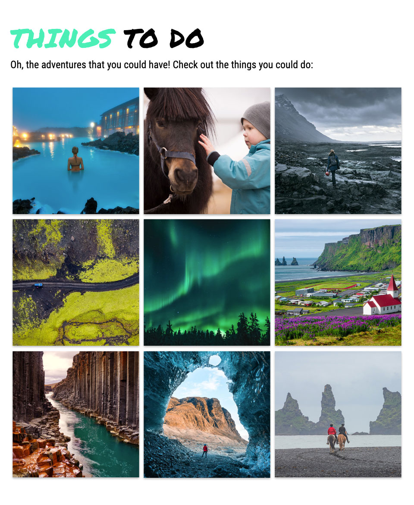

# Iceland cubed excursions

Presented in Quality Assurance, New Media Design and Web Development in British Columbia Institute of Technology – Summer 2022 

| Title                                       | Description                                           |
| ------------------------------------------- | ----------------------------------------------------- |
| Project Status | Finished |
| Project Type | Project Type |
| Project Duration | 3 Weeks (July 2022 - August 2022) |

__ __
## About
 
Iceland Cubic Excursions’ (ICE) is a fictional tour agency that specialises in creating custom travel packages for Canadians looking to vacation in Iceland. We offer Canadians who are looking to travel worry-free to Iceland adapted tour packages that are unique to their individual needs. The site we will build will overview our services, giving users a seamless way to send our expert their party information in order to inquire about the 3 unique travel packages that we offer.

Users should, therefore, be able to select the package that they are interested in and send their travel information to ICE’s experts, so that they may receive a quote for the package that suits their specific needs.

[Live site](https://icelandcubedexcursions.anitalam.ca/)

__ __

__ __
## Team
* [Anita Lam](http://anitalam.ca/) | Developer (Lead developer – Index page)
* [Misun Kim](https://portfolio.misunkim.ca/) | Developer (Contact page)
* [Carissa so](http://carissaso.ca/) | Project Manager & QA leader
* [Euhye Jang](https://eunhye-jang.ca/) | Designer (Graphic & UI & Figma)

__ __
## Specification

 __ __ 
|
| **Objectives** |
| <ul><li>Develop interactive website and checking quality assuarance</li><li>Building a responsive website using Tailwind</li><li>Working as a team by Agile method</li></ul>|
| **Configuration** |
| <ul><li>Window 10 (Chorme/ Firefox /Edge)</li><li>MacOS Big Sur(Chorme/ Firefox /Edge)</li></ul> |
| **Dependencies** |
| <ul><li>[Tailwind v3.1.8](https://tailwindcss.com/docs/installation)</li></ul> |
| **Design Tools** |
| <ul><li>Figma</li></ul> 
__ __
## Documentation
* [MockUp](https://www.figma.com/proto/88FTKyhsf1Am1lKix6Fh0L/ICE?node-id=2%3A27&scaling=scale-down&page-id=0%3A1&starting-point-node-id=2%3A27)
* [QA Check list](https://docs.google.com/document/d/16VdX78LR7wkA-d6ozDqCfgHQl2pOFSVo/edit)

__ __
## What I've learned
  
| Memeber                                        | Description                                           |
| ------------------------------------------- | ----------------------------------------------------- |
| Anita Lam | <ul><li>Website building using TailWindCSS framework</li><li>Writing CSS in the form of classes within the HTML file</li><li>The availability of utility classes made it quicker to build responsive layouts</li><li>Increased knowledge of CSS</li><li><b>DIFFICULTIES FACE:</b> process of setting up the project</li><li>As the styles increased, the HTML file started to look confusing</li></ul>|
| Misun Kim | <ul><li>Building a responsive website using Tailwind</li><li>Understanding framework structure and installation process</li><li>Understanding responsive layout(unit– rem, because tailwind using rem, breakpoint, flex)</li><li>Communicate with team by project board</li><li>Manage the issue with project board and solve it</li></ul> |
| Carissa so | <ul><li></li><li></li></ul> |
| Eunhye Jang | <ul><li></li><li></li></ul> |

   

